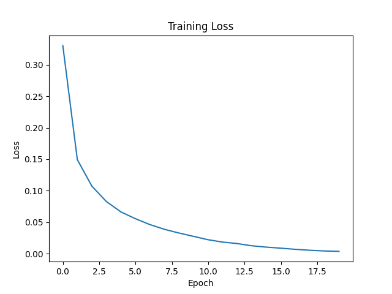

# mlp-from-scratch
A multilayer perceptron (MLP) built from scratch using only NumPy(no PyTorch or TensorFlow are used). Implements forward passes, backpropagation, and gradient descent by hand to demonstrate how neural networks actually work.

Trained on MNIST (70,000 handwritten digital images) to classify digits 0-9, achieving **97.9% test accuracy** in 20 epochs.

## Results
| Epoch | Loss | Test Accuracy |
|-------|------|---------------|
| 1 | 0.3304 | 94.5% |
| 10 | 0.0275 | 97.7% |
| 20 | 0.0037 | 97.9% |

## Project Structure
```
src/
├── layers.py       # Linear layer, contains forward pass (Wx + b) and backpropagation gradients
├── activations.py  # Activation functions, contains ReLU, non-linearities between layers
├── losses.py       # CrossEntropyLoss, measures prediction error and starts backprop process
├── optimizers.py   # SGD optimizer, updates weights using computed gradients
└── network.py      # MLP class, chains all layers together for forward/backward pass
train.py            # Loads MNIST, builds the model, runs the training loop
```

## How It Works
1. **Forward pass:** input data flows through each layer in sequence: `Linear -> ReLU -> Linear -> ReLU -> Linear`
2. **Loss:** the output logits are passed to `CrossEntropyLoss`, which computes how wrong the predictions are
3. **Backward pass:** gradients flow back through every layer in reverse, each one computing how much its weights contributed to the error
4. **Update:** the optimizer uses those gradients to nudge every weight in the direction that reduces the loss

## Model Flow
```
Input         Linear           ReLU       Linear          ReLU       Linear        Output
784 nodes  -> 128 nodes  ->  (filter)  -> 64 nodes  ->  (filter)  -> 10 nodes  ->  predicted digit (0-9)
```
- **784 nodes:** one input node per pixel (28x28 image flattened into a single row)
- **128 -> 64 nodes:** the network compresses the pixels into smaller sets of learned features each layer
- **ReLU:** filters out negative values between layers so the network can learn non-linear patterns
- **10 nodes:** one confidence score per possible digit (0-9); scores are converted to probabilities (0.0-1.0) via softmax and the number with the highest probability is the prediction

## Results


## Dependencies
```
numpy
matplotlib
scikit-learn
```
